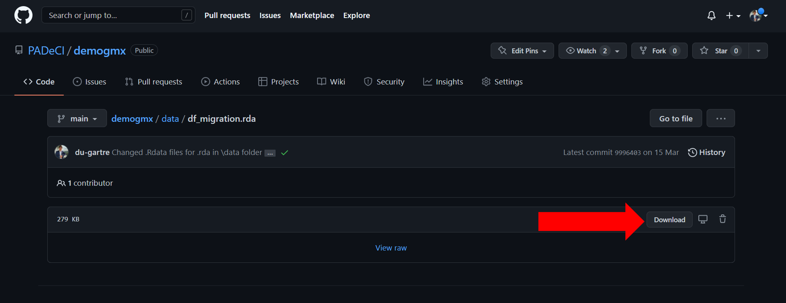

<!-- README.md is generated from README.Rmd. Please edit that file -->

# demogmx 

# VERSIÓN EN ESPAÑOL: *Datos demográficos de México*

# Sobre este repositorio :open_book:

[PADeCI](https://padeci.org/) es un equipo de investigación
interdisciplinario ubicado en el [CIDE Región
Centro](https://www.cide.edu/regioncentro/) en Aguascalientes, México.
Con el contenido de este repostiorio se construyen diversas bases de
datos de información demográfica de México, necesaria para los
diferentes proyectos de PADeCI. Las series de tiempo poblacionales se
construyen a partir de la información pública del Consejo Nacional de
Población (CONAPO). Gracias a las proyecciones realizadas por el CONAPO,
este repositorio cuenta con información sobre el tamaño de la población
mexicana desde 1970, hasta el año 2051. Además de la población en un año
específico, se incluyen proyecciones para el número de *nacimientos*,
número de *muertes*, *migración* interestatal e internacional así como
la tasa de envejecimiento. Hay bases para diferentes necesidades:
desagregadas por año, por entidad federativa, por sexo y por edad. Las
personas interesadas pueden utilizar los datos ofrecidos en este
repositorio para cualquiera de sus proyectos profesionales o personales.
Además de ser una herramienta de investigación, el respositorio también
abre la oportunidad a que cualquier persona replique el proceso de
limpieza y generación de datos hecho por PADeCI, siguiendo así los
principios científicos de *transparencia* y *replicabilidad*.

# Requisitos :computer:

R version 4.1.2 (esta es la versión recomendada para evitar errores en
el código, también conocidos como *bugs*).

# Uso :inbox_tray:

Cualquier persona puede replicar el trabajo de PADeCI, ya sea clonando
este repositorio en su computadora o descargando archivos específicos.
Los datos también se pueden utilizar sin necesidad de descargar, ni
clonar el respositorio: basta con utilizar el URL que GitHub provee de
la base de datos específica que se desea utilizar en formato raw, a
continuación se presenta un ejemplo de cómo acceder a los datos usando
este método.

## Ejemplo de uso de los datos (extracción directa con url de GitHub desde R)

**1. Seleccionar la base de interés**

El repositorio incluye numerosas bases de datos sobre nacimientos,
población, migración y fallecimientos. En este caso utilizaremos la base
de migración desagreada por entidad federativa.

**2. Importar base de datos directamente desde Github**

En Github está la opción para descargar directamente la base de datos.
Es importante notar que todas las bases que están en el paquete tienen
el formato .rda que es particular de R.



**3. Cargar base de datos**

Una vez descargada, la base de datos puede cargarse en el ambiente de R
con el siguiente comando.

``` r
df_nueva <- load(file = ".../df_migration.rda")
```

Tómese en cuenta que los tres puntos antes de la diagonal son para
indicar la ubicación del archivo en el directorio, ya sea de la
computadora o sea dentro de algún proyecto de R.

**4. Explorar datos**

Para una exploración rápida de la base se puede utilizar el comando
`head()` y para ver toda la base el comando `View()`. En este ejemplo
sería:

``` r
head(df_nueva) 
View(df_nueva) 
```

A partir de este punto el usuario puede decidir qué hacer con los datos
y realizar su propio análisis.

# Descripción de las carpetas :card_index_dividers:

**1. R:** En esta carpeta se ubican los códigos de las funciones para
obtener las bases de datos filtradas con base en los parámetros
indicados por el usuario.

**2. analysis:** En la carpeta de análisis se encuentran archivos donde
se ejecutan las funciones para obtener bases de datos así como otros
códigos de modelación basados en los datos del repositorio.

**3. data-raw:** Aquí se almacenan los datos descargados directamente
desde fuentes oficiales sin haberles realizado ningún cambio en su
contenido. Esta carpeta también incluye los códigos utilizados para
limpiar, expandir y organizar las bases de datos, según sea el caso. La
información detallada sobre estas bases se encuentra en la carpeta
*documents*.

**4. data:** En esta carpeta se encuentran las bases de datos limpias y
listas para ser utilizadas. Las bases de datos tienen formato .rda y, en
caso de que la paquetería se encuentre cargada, pueden ser accedidas
desde la consola escribiendo su nombre. Por ejemplo, se puede acceder a
la base de migración al ejecutar `df_migration` desde la consola.

Las bases de datos de esta carpeta contienen las siguientes variables:

-   Variables demográfica
    -   Número de habitantes (población)  
    -   Número de nacimientos
    -   Número de muertes
    -   Número de inmigrantes/emigrantes
-   Niveles de desagregación espacial
    -   Estatal
-   Niveles de desagregación temporal
    -   Año de la(s) variable(s)
-   Variables de características personales
    -   Sexo
    -   Edad

**5. documents:** La carpeta de documentos incluye los diccionarios de
datos y fichas técnicas sobre las bases de datos contenidas en este
repositorio.

# Cómo citar este respositorio :handshake:

# Autoras y autores :writing_hand:

| Name                     | Github                                     | Twitter                                      |
|--------------------------|--------------------------------------------|----------------------------------------------|
| Fernando Alarid-Escudero | [GitHub](https://github.com/feralaes)      | [Twitter](https://twitter.com/feralaes)      |
| David Garibay            | [GitHub](https://github.com/du-gartre)     | [Twitter](https://twitter.com/du_garibay)    |
| Mariana Fernández        | [GitHub](https://github.com/marianafdz465) | [Twitter](https://twitter.com/marianafdz_97) |
| Andrea Luviano           | [GitHub](https://github.com/AndreaLuviano) | [Twitter](https://twitter.com/AndreaLuviano) |
| Regina Isabel Medina     | [GitHub](https://github.com/RMedina19)     | [Twitter](https://twitter.com/regi_medina)   |
| Hirvin Díaz              | [GitHub](https://github.com/HirvinDiaz)    | [Twitter](https://twitter.com/HazaelDiaz93)  |

# Licencia de uso :scroll:

El contenido de este repositorio debe utilizarse bajo las condiciones de
la [licencia MIT](LICENSE).

------------------------------------------------------------------------

# ENGLISH VERSION: *Mexico’s demographic data*

# About this repository :open_book:

[PADeCI](https://padeci.org/) is an interdisciplinary research team
based at [CIDE Región Centro](https://www.cide.edu/regioncentro/) in
Aguascalientes, Mexico. With this repository’s content several data
bases with Mexico’s demographic information are constructed. This
informatión is needed for many of PADeCI’s projects. Population time
series are constructed with public information provided by the National
Population Council (CONAPO by its spanish acronym). Thanks to
projections made by CONAPO, the datasets contain information from 1970
to 2051. Besides of the population on a given year, proyections
regarding the number of *births*, the number of *deaths*, the interstate
and international *migration*, and the aging rate, are included.
Interested persons can use the data of this repository for any of their
professional or personal projects. In addition to being a research tool,
the repository also opens the opportunity for anyone to replicate the
process of data cleaning and generation carried out by PADeCI, following
the scientific principles of *transparency* and *replicability*.

# Requirements :computer:

R version 4.1.2 (version recommended to avoid potential bugs.)

# Usage :inbox_tray:

Any user can either clone this repository in its own computer or
download specific files in order to replicate PADeCI’s job.It suffices
with using the URL of the raw format provided by GitHub of the data base
of interest. A quick example of how to retrive data with the last method
is shown below.

## Use example (extracting data with GitHub’s URL from R)

**1. Select dataset of interest**

The repository includes several datasets regarding births, population,
migration and mortality. In this case, we will use the dataset for anual
migration disagregates by state.

**2. Import datasets from Github repository**

Once the data base is chosen, it can be directly downloaded from its
location in the Github repository. Note that all the cleaned datasets in
this repository have an .rda format.

<p align="center">


</p>

**3. Load datasets**

After downloading the file. The data set can be loaded in R by using the
next code:

``` r
df_new <- load(file = ".../df_migration.rda")
```

Note that the three periods before the diagonal indicate the file
location within the computer directory or within any R project.

**4. Explore data**

For a quick data exploration, the `head()` command can be used; in order
to see the whole data frame, `View()` command must be used. Following
our example:

``` r
head(df_new) 
View(df_new) 
```

At this stage, the user can decide what to do with data and proceed with
her own analysis.

# Folders’ description :card_index_dividers:

**1. R:** This folder stores the R scripts that stores functions needed
for obtaining the filtered datasets based on parmaeters set by the user.

**2. analysis:** This folder contains script files that execute the
functions stored in the R folder as well as other modelling scripts
based on the datasets of this repository.

**3. data-raw:** The datasets downloaded directly from oficial sites and
without any change in its content are stored in this folder. Here, the
scripts used to clean, expand and organize the raw datasets can be
found. Information about the raw datasets can be found in the
*documents* folder.

**4. data:** In this foler the cleaned datasets can be found. The
datasets contained here have .rda format and, if the library is loaded,
this datasets can be accesed through the console by only writting their
name. For instance, the migration dataset can be accesed by executing
`df_migration` in the console.

The datasets from this folder have the following variables:

-   Demographic variables
    -   Number of inhabitants (population)
    -   Number of births
    -   Number of deaths
    -   Number of immigrants/emigrants
-   Spatial dissagregation levels
    -   State
-   Temporal dissagregation levels
    -   Year of the data
-   Personal characteristic variables
    -   Sex
    -   Age

**5. documents:** This folder contains the dictionaries and technical
reports of the datasets.

# How to cite this repository :handshake:

# Authors :writing_hand:

| Fernando Alarid-Escudero | [GitHub](https://github.com/feralaes)      | [Twitter](https://twitter.com/feralaes)      |
|--------------------------|--------------------------------------------|----------------------------------------------|
| David Garibay            | [GitHub](https://github.com/du-gartre)     | [Twitter](https://twitter.com/du_garibay)    |
| Mariana Fernández        | [GitHub](https://github.com/marianafdz465) | [Twitter](https://twitter.com/marianafdz_97) |
| Andrea Luviano           | [GitHub](https://github.com/AndreaLuviano) | [Twitter](https://twitter.com/AndreaLuviano) |
| Regina Isabel Medina     | [GitHub](https://github.com/RMedina19)     | [Twitter](https://twitter.com/regi_medina)   |
| Hirvin Díaz              | [GitHub](https://github.com/HirvinDiaz)    | [Twitter](https://twitter.com/HazaelDiaz93)  |

# License :scroll:

This repository’s content must be used under the terms and conditions of
the [MIT License](LICENSE)
