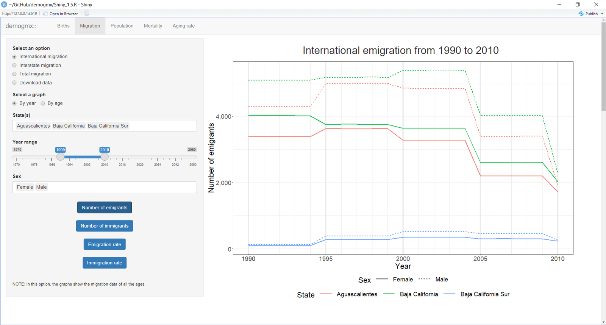
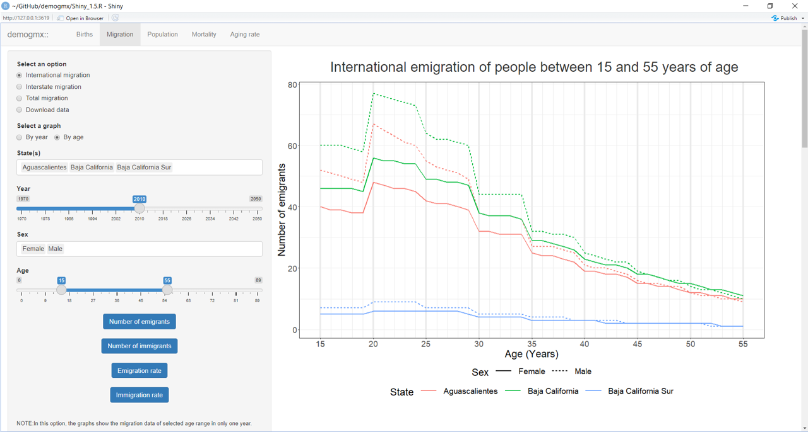
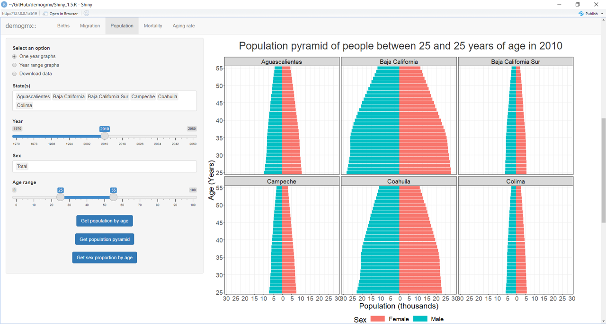
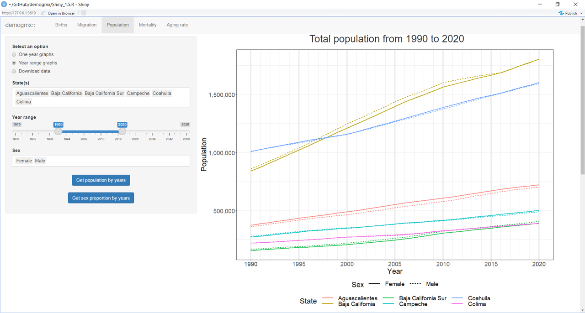
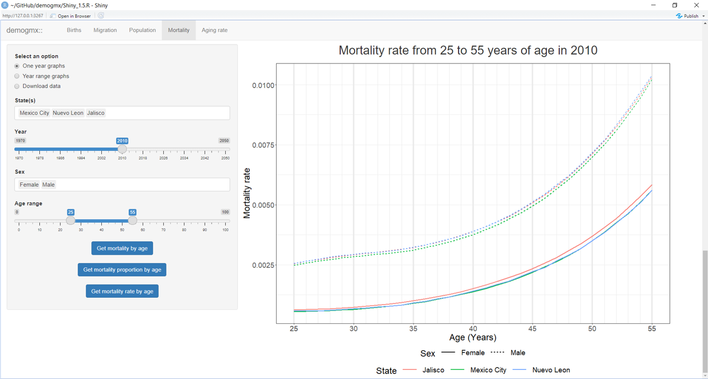
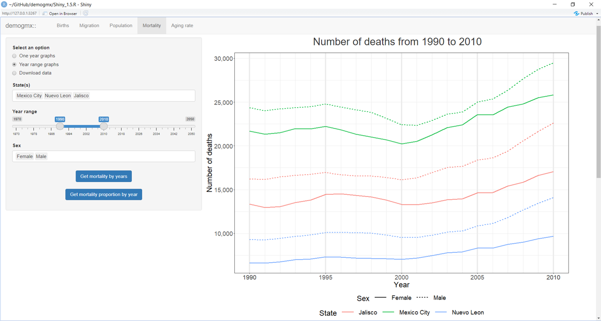
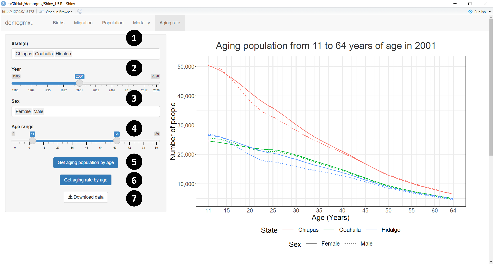

demogmx::Shiny user vignette
================
PADeCI
April/2022

Welcome!

This vignette is intended to give a brief and consistent guide to use
the shiny app embedded in the `demogmx` package. This app was created to
give a friendly approach to the information present in this package
through two general ways: visualizations and access to information.

In relation to the **visualizations**, this app permits the user to
filter the data based on parameters like the state, the year, and the
sex. Once this selections have been made, the app can make different
visualizations by simply clicking on the blue buttons.

Regarding the **access of the data,** a copy of the package data-sets
can be obtained in .csv format. To do that, first the parameter set must
be defined and then the data will start to download by clicking the
*Download data* button.

# Structure of the app

Once the shiny app is in execution it will appear as a new window or tab
in your browser. This app has three main areas:

-   The **tabset panel** - shows the main divisions between the types of
    demographic information available in the package. The births,
    migration, population, mortality and aging tabs are available. By
    selecting a new tab the shiny app will show a new page with specific
    filters and options, related to the selected type of demographic
    data, will appear. This panel is shown in the next figure as the
    area contained in the red rectangle

-   The **sidebar panel** - gives different options and filters that the
    user must to define in order to obtain specific visualizations and
    data-sets. It is placed at the left side of the window. Each tab has
    a different sidebar panel because the options and the filters of
    each type of demographic information will have unique
    characteristics. This panel can be seen in the next figure as the
    area contained in the green
    rectangle.

-   The **main panel** - contains the area with the greater extent and
    it is used to visualize the created graphs, based on the user
    specifications. This part can be scrolled down in order to see the
    different visualizations that are available in each tab. The main
    panel is the area contained in the blue
    rectangle, in the following figure.

Now we will focus in the characteristics and options that each tab has
to offer.

# Births tab

This tab provides birth visualizations and data. To get them the user
has to define the following parameters (the numbers in parentheses refer
to those in the image at the end of this section):

-   Select the states **(1).** This option allows the user to select the
    states that will be included in the graphs and/or in the
    downloadable data-sets. It is important to note that the magnitudes
    of each state’s births can alter the visualization of certain
    graphs.

-   Select years **(2).** Here the range of years included in the graphs
    and in the data is defined. Do not forget to read the notes at the
    bottom of the sidebar panel. If *Female* or *Male* are selected in
    the sex option, the available years will be reduced from 1985 to
    2020 because a different data-set will be used.

-   Select Sex **(3).** In this part, the sex contained in the graphs
    and in the downloadable data-set is defined. As we were saying,
    there are three possible options to select: *Female*, *Male* or
    *Total*. If the latter is selected the graphs will show the
    aggregated data of both sexes.

Once the user has defined the previous parameters, three different types
of graphs can be created:

1.  The number of births **(4)**
2.  The birth rate **(5)**
3.  The sex proportion of the births **(6)**

In all of them the X-axis represent the year of the data and, to ease
the visualization, the vertical thicker gray lines are placed in the
years that are multiples of five. Also, in all the graphs, each state
has a unique color and each sex a unique type of line. To obtain the
graphs, it is only necessary to click in the corresponding button.

In addition, a births data-set can be downloaded by clicking the
*Download data* button **(7).** The data will be filtered based on the
specifications made by the user in the sidebar panel options. The format
of the downloadable file is .zip and within it there are two .csv files,
one based on the information of Mexico’s National Council of Population
(CONAPO, by it’s acronym in Spanish) and the other containing the
information provided by the National Institute of Statistical and
Geographical data (INEGI, by it’s acronym in Spanish).

For more information on the information sources please check the *Get
demographic data* vignette.

# Migration tab

This tab has two initial sets of options. In the first, the user has to
decide which one of the three types of migration available is going to
use in the graphs **or** if the user is not interested in graphing and
wants to get the data instead, *Download data* is a fourth option.

## International, Interstate and Total migration

The three types of migration are *International* migration, the
*Interstate* migration and the *Total* migration, respectively. The
Total migration is the aggregate of the other two. Note that if
*National* is chosenin the State(s) option and Interstate migration is
also selected, the graphs will be in blank because at a country level
there is only international migration.

### By year or by age?

Once the user have defined the type of migration, there is an additional
set of two options that give the possibility to generate visualizations
that show the data across multiple years (**by year**) or to generate
them showing the migration characteristics by age based in the migration
that occurred in a single year (**by age**).

In both cases the *state(s)* and the *sex(es)* shown in the
visualization can be defined by the user. If *By year* is selected the
date option will be a year range, otherwise, if *By age* is chosen,the
date option will become a single year and an age option will appear, in
it option the user must define the age range of the migration population
included in the graphs.

No matter the type of graph you choose (by year or by age) the available
set of graphs will be the same. The main difference will be the X-axis
of the graphs. If *By year* is chosen, it will show the selected years,
if you choose *By age*, it will show the specified age range.

Here are two examples of how the data can be seen:

The graph number of emigrants selecting the option *By year* will show
the emigration of each state, across the years.

The graph number of emigrants selecting the option *By age* will show
the emigration of each state in one year disaggregating the information
by ages in the X-axis.

## Download data

The fourth alternative in the first set of options allows the user to
download the specified migration data. However, in this option **all**
the types of migration, states, years, sexes and ages of the migration
data, contained in the `demogmx` package, can be selected.

Once the desired migration characteristics have been defined then the
data can be downloaded by clicking the *Download data* button at the
bottom of the side bar panel of the `Migration` tab. The data will be
downloaded in a .csv file.

# Population tab

This tab provides graphs and data concerning the population registered
in Mexico. It has a initial sets of options. The first two define which
type of graphs will be generated in the app and the last one allows to
download the population data with all the possible options available in
the data.

First, we will talk about the first two alternatives to make
visualizations.

## One year or range of years?

This two options allows the user to generate visualizations that show
the data contained in one single year (**one year graphs**) or the data
across multiple years (**year range graphs**).

In both cases the *state(s)* and the *sex(es)* can be defined by the
user in the same way. If *one year graphs* is chosen the year selection
will be made with a simple slider and the age ranges option will be
available. If *year range graphs* is selected, then the user will define
the minimum and maximum value of the years that will be used in the
graphs in the year range option.

Two types of visualizations can be generated in both options (*one year*
and *range year graphs*). These graphs will show the size of the
population and the sex proportion. However, the way that this
information is presented is different. If the data is defined to one
year, the X-axis of the graphs will represent the selected ages of the
population. Instead, if the data includes multiple years, the X-axis
will represent the defined range of years.

There’s a graph that is only available in the *one year graphs* option:
the population pyramid. To generate this graph a set of states and a the
age range that will be included in the graph must be defined. In the
following figure we can see an example of this visualization.

Here is an example of how the population graph is generated if the *year
range* option is selected. We can see that each color represents a
particular state and that each type of line is related to a specific
sex.

## Download data

The last alternative in the first set of options allows the user to
download the specified population data. However, in this option **all**
the population data parameters (states, year ranges, sexes and age
ranges) can be selected.

Once the population characteristics have been defined then the data can
be downloaded by clicking the *Download data* button at the bottom of
the side bar panel. The data will be downloaded in a .csv file.

# Mortality tab

This tab provides graphs and data concerning the registered deaths in
Mexico. As we can see in the app, and in the next two figures, it shares
the initial structure of the population tab. It has a initial sets of
options, where the first two are used to generate graphs based in one
year or in multiple years data and where the third option permits to
download mortality data based on the user specifications.

## One year or range of years?

As in the population tab, in both cases the *state(s)* and the *sex(es)*
can be defined by the user in the same way. If *one year graphs* is
chosen the year selection will be made with a simple slider and the age
ranges option will be available. If *year range graphs* is selected, the
user will define the minimum and maximum value of the years that will be
used in the graphs in the year range option.

Two types of visualizations can be generated in both options (*one year*
and *range year graphs*). These graphs will show the number of deaths
and the death proportion by sex. However, the way that this information
is presented is different. If the data is defined to one year, the
X-axis will represent the ages of the population. If the data includes
multiple years, then, the X-axis will represent the years defined by the
user.

There’s a graph that is only available in the *one year graphs* option:
the mortality rate by age. To generate this graph all the parameters in
the side bar panel must be defined. In the following figure we can see
an example of this visualization.

In the previous graph we can see that the colors represent the states
and the types of lines are related to a specific sex.

In addition, an example of how a mortality graph is generated if the
*year range* option is selected is shown in the next figure.

## Download data

The last alternative in the first set of options allows the user to
download the specified mortality data. However, in this option **all**
the mortality data parameters (states, year ranges, sexes and age
ranges) can be selected.

Once the mortality characteristics have been defined then the data can
be downloaded by clicking the *Download data* button at the bottom of
the side bar panel. The data will be downloaded in a .csv file.

# Aging rate tab

This tab provides visualizations and data on the aging population. To
get them it is necessary to define the states **(1)**, years **(2)**,
sexes **(3)** and the age range **(4)** of the desired population. In
this tab, the available years to select range from 1985 to 2020 and the
possible range of ages goes from 0 to 89 years old. The bold numbers
inside the parentheses refer to the numbers in the figure at the end of
the section of this tab.

Once the user has defined the parameters, two graphs can be created:

1.  Get aging population by age **(5)**
2.  Get aging rate by age **(6)**

In those graphs the X-axis represent the age of the population and, as
in previous graphs, each state is represented by a unique color and each
sex by a specific type of line.

Once the parameter set is defined, the data user can be downloaded by
clicking the *Download data* button **(7).** The format of the
downloaded file is .csv.

