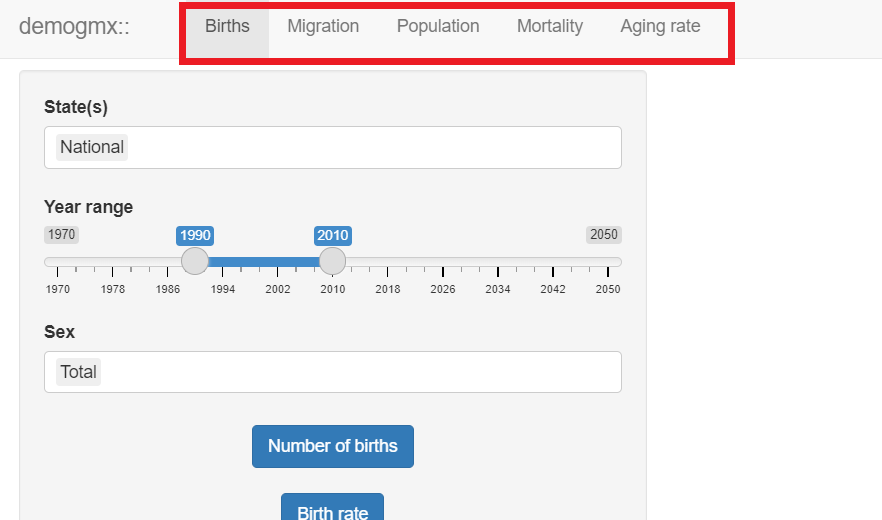

```{r setup, include=FALSE}
knitr::opts_chunk$set(echo = TRUE)
```

Talk about

-   Objectives of the shiny

    -   Interactive visualization of mexican demographic data

    -   Download the required data to realize professional or personal projects of the users

-   Organization of the shiny app

    -   Tabs for each type of information available in the package: births, population, migration, mortality and aging rate.

{width="100%"}

# Births tab

# Migration tab

# Population tab

# Mortality tab

# Aging rate tab
